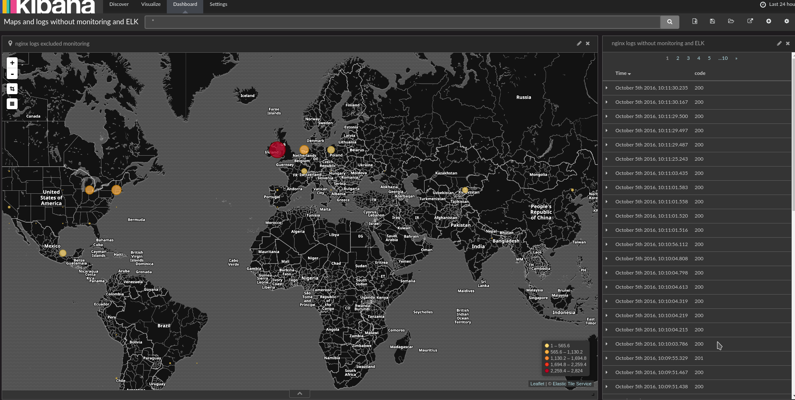
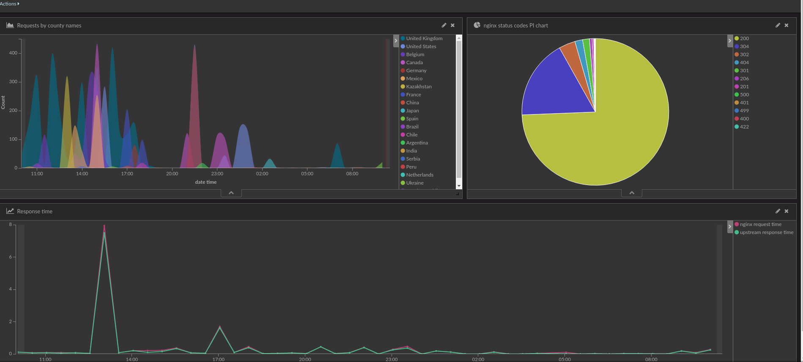

# Info

This repo deploys ELK (actually **EFK**: **Elasticsearch, Fluentd, Kibana**. But ELK abbreviation is more popular) stack with the following deployments/daemonsets:

* Elasticsearch
  * ~~es-data~~
  * ~~es-master~~
  * es-data-master
  * es-client (client nodes which allow to communicate with the elasticsearch cluster, we use 2 pod replicas)
* fluentd - we use daemonsets, so fluentd is being scheduled on all worker nodes.
* kibana - one instance is enough. But you can easily scale it to two or more instances.

## Assumptions

### Stateless storage

This repo contains Elasticsearch manifests which use stateless disk storage (`emptyDir`). Fortunately using Elasticsearch [Replica Shards](https://www.elastic.co/guide/en/elasticsearch/guide/current/replica-shards.html) we have data redundancy. An amount of replica shards could be defined in [`es-env.yaml`](es-env.yaml) configmap, default value is 1 which allows to survive one Elasticsearch data pod failure. When one Elasticsearch data pod is down (or removed), Kubernetes Deployment will schedule a new one.

One replica shard requires at least **three Elasticsearch data pods**. Rolling upgrade will relocate all the data from the pod prepared to be terminated. If you have only two data pods, there will be no place to move replica shards.

### Scheduling only one Elasticsearch data pod per node

Kubernetes supports Daemonsets but they don't provide rolling upgrade feature. Thus this repo contains Deployment manifests with a hack - custom `hostPort` (it is commented out by default in the [`es-data-master.yaml.tmpl`](es-data-master.yaml.tmpl) template) which doesn't allow to schedule two pods of one replicaset on one node. Uncomment this setting in case when you use private network to ensure that Kubernetes will schedule one pod per node.

Kubernetes 1.4 introduced [Inter-pod affinity and anti-affinity](http://kubernetes.io/docs/user-guide/node-selection/#inter-pod-affinity-and-anti-affinity-alpha-feature) which also could be used to resolve this issue.

### Bash templates

Unless Kubernetes implement its own templating support, users have to use what they have (or use [Helm](https://github.com/kubernetes/helm) which should be installed). In most cases POSIX shell could be used and you don't have to install additional dependencies that is why `deploy.sh` uses `render_template` function as a hack that imposes appropriate restrictions: **if you wish to use double quotes inside the shell template you have to escape them**:

```sh
\"sample value inside double quotes\"
```

### Split Elasticsearch pods by roles

In this example master and data roles are merged into one `es-data-master` pod. In case when you wish to split them, use `es-data.yaml.tmpl_` and `es-master.yaml.tmpl_` correspondingly.

## Rolling upgrade

[`run.sh`](docker/elasticsearch/run.sh) script inside Elasticsearch image contains shutdown handler which waits until the node move out all its data to another cluster nodes. And only when there is no data - pod shuts down. [`es-data-master.yaml.tmpl`](es-data-master.yaml.tmpl) template contains a `terminationGracePeriodSeconds: 31557600` option which prevents premature pod kill.

# Ingress example

Example of an ingress controller to get an access from outside:

```yaml
apiVersion: extensions/v1beta1
kind: Ingress
metadata:
  annotations:
    ingress.kubernetes.io/auth-realm: Authentication Required
    ingress.kubernetes.io/auth-secret: internal-services-auth
    ingress.kubernetes.io/auth-type: basic
    kubernetes.io/ingress.allow-http: "false"
  name: ingress-monitoring
  namespace: monitoring
spec:
  tls:
  - hosts:
    - kibana.example.com
    - elasticsearch.example.com
    secretName: example-tls
  rules:
  - host: kibana.example.com
    http:
      paths:
      - backend:
          serviceName: kibana-logging
          servicePort: 5601
        path: /
  - host: elasticsearch.example.com
    http:
      paths:
      - backend:
          serviceName: elasticsearch-logging
          servicePort: 9200
        path: /
```

# Monitoring the cluster state

We use `kopf` plugin for elasticsearch. You can view the cluster state using links below:

* [https://elasticsearch.example.com/_plugin/kopf/](https://elasticsearch.example.com/_plugin/kopf/)
* [https://kibana.example.com/status](https://kibana.example.com/status)

# Surviving the reboot

When you reboot the node, ES instance will become faily. Quick hook to make it happy - kill it. Kubernetes Deployment will create a new pod, it will sync all replicas and ES cluster state will be green.

# Kibana and GEO data

Fluentd container is already configured to import indices templates. If templates were not improted, you can import them manually:

```sh
wget https://github.com/logstash-plugins/logstash-output-elasticsearch/raw/master/lib/logstash/outputs/elasticsearch/elasticsearch-template-es2x.json
curl -XPUT 'https://elasticsearch.example.com/_template/logstash-*?pretty' -d@docker/fluentd/elasticsearch-template-es2x.json
```

Please note that if the index was already created (i.e. brand new deploy), you have to remove old index with incorrect data:

```sh
# This index has incorrect data
curl -s -XGET https://elasticsearch.example.com/logstash-2016.09.28/_mapping | python -mjson.tool | grep -A10 geoip
    "geoip": {
	"properties": {
	    "location": {
		"type": "double"
	    }
	}
    }
# Here how to delete incorrect index (ALL THIS INDEX DATA WILL BE REMOVED)
curl -XDELETE https://elasticsearch.example.com/logstash-2016.09.28
```

or wait until new index will be created (in our setup new index is being created every day).

# Forward Kubernetes events into Kibana/Elasticsearch

`k8s-events-printer.yaml` manifest is a simple `alpine` container with `curl` and `jq` tools installed. It prints all Kubernetes events into stdout and `fluentd` just parses and forwards these events into Elasticsearch as a regular json log.

# Known issues

* `journald` logs don't show up in Kibana, probably because of the TZ issues
* `DELETED` Kubernetes events could not be stripped for now, you have to create an exclude rule for `type:"DELETED"`, otherwise these events confuse Kibana users.

# TODO

* Convert this repo into [Helm](https://github.com/kubernetes/helm) format.

# Credits

* This repo uses modified config files from https://github.com/pires/kubernetes-elasticsearch-cluster
* `pre-stop-hook.sh` from https://github.com/jetstack/elasticsearch-pet

# Pictures



